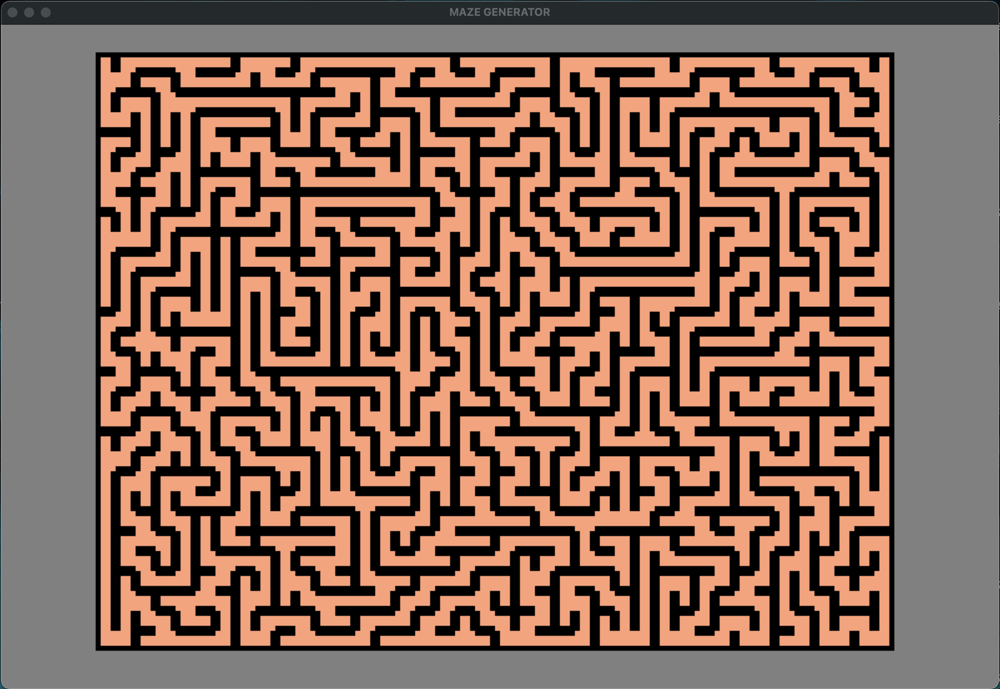

# Maze Generator in Python

The program generates a random maze with the number of rows and columns given by user input. Depth First Search(DFS) is used to determin the content of the maze. The generating process is visualized by using Pygame.
## Table of Contents

<!-- - [Introduction](#introduction) -->
- [Features](#features)
- [Installation](#installation)
- [Usage](#usage)
- [Contributing](#contributing)
- [License](#license)

<!-- ## Introduction

Provide a brief introduction to the project, explaining its purpose and goals. -->

## Features

When you run the program, It asks you to choose the number of rows and columns of the maze. Try with 30 rows and 40 columns for example.


The algorithm used is DFS. To visuallize the process of the algorithm, visited tiles, closed tiles (popped from DFS stack), the current tile, and walls are colored in Green, Pink, Red, and Black. 

The generating process running:


After the maze is completed, All the tiles will be colored pink.

Final Output :

## Installation

Follow these steps to install the projects:
1. Clone the repository:
```bash
git clone https://github.com/rabiken/maze_generator.git
cd maze_generator
```
2. Create and activate a virtual environment:
- On macOS and Linux:
```bash
python3 -m venv venv
source env/bin/activate
```
- On Windows:
```cmd
py -m venv venv
.\env\Scripts\activate
```

3. Install the required dependencies:
```bash
pip install -r requirements.txt
```
## Usage

1. Run the program by:
- On macOS and Linux:
```bash
python3 main.py
```
- On Windows:
```cmd
py main.py
```

## Contributing

If you encounter any bugs or issues with the project, please let me know! Your feedback is invaluable for improving the project. 

## License
MIT
